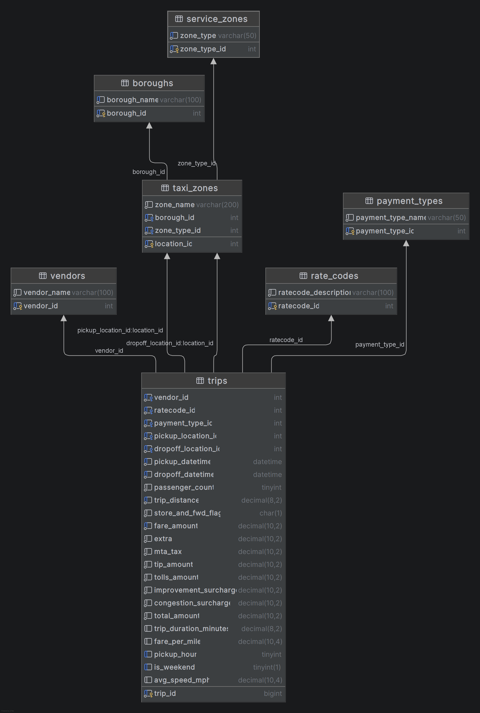

# Urban Mobility Data Explorer

An interactive web dashboard for exploring **NYC Yellow Taxi trip data** (January 2019). Built with Python Flask, PostgreSQL, and vanilla JavaScript with Chart.js.

> **Video Walkthrough:** [Link to Video]()


## What It Does

- Cleans and processes 7.6 million raw taxi trip records
- Stores the data in a normalized PostgreSQL database
- Serves the data through a Flask REST API
- Displays an interactive dashboard with charts, filters, and a trip records table

```

### Database Schema (ERD)




## Project Structure

```
Urban-mobility-data-Explorer/
├── backend/                  # Flask API
│   ├── app/
│   │   ├── api/              # Route handlers (trips, analytics)
│   │   └── db/               # Database connection
│   ├── config.py             # Loads environment variables
│   ├── requirements.txt      # Python dependencies
│   └── run.py                # Starts the Flask server
├── data/                     # Data processing scripts
│   ├── clean_tripdata.py     # Cleans and validates raw trip data
│   ├── feature_engineering.py# Adds derived columns
│   ├── data_pipeline.py      # Runs cleaning + engineering in order
│   └── taxi_zone_lookup.csv  # Zone dimension table
├── frontend/                 # Web dashboard
│   ├── index.html            # Main page
│   ├── styles.css            # Styling
│   └── dashboard.js          # Charts, table, and filters
├── database/                 # SQL schema files
├── load_trips.py             # Loads cleaned CSV into PostgreSQL
├── .env.EXAMPLE              # Template for environment variables
└── README.md
```


## Requirements

- Python 3.10+
- PostgreSQL 14+
- A modern web browser (Chrome, Firefox, Edge)


## Setup Instructions

### 1. Clone the repository

```bash
git clone https://github.com/Abdull-Kudus/Urban-mobility-data-Explorer.git
cd Urban-mobility-data-Explorer
```

### 2. Create a virtual environment

```bash
python -m venv .venv
```

Activate it:

- **Windows:** `.venv\Scripts\activate`
- **Mac/Linux:** `source .venv/bin/activate`

### 3. Install Python dependencies

```bash
pip install -r backend/requirements.txt
```

### 4. Set up environment variables

Copy the example file and fill in your PostgreSQL credentials:

```bash
cp .env.EXAMPLE .env
```

Edit `.env`:

```
DB_HOST=localhost
DB_PORT=5432
DB_NAME=urban_mobility
DB_USER=postgres
DB_PASSWORD=your_password_here
DB_SSLMODE=disable
```

### 5. Create the database

Open PostgreSQL and run:

```sql
CREATE DATABASE urban_mobility;
```

Or use Python:

```bash
python -c "
import psycopg
conn = psycopg.connect(host='localhost', port=5432, dbname='postgres', user='postgres', password='your_password', autocommit=True)
conn.cursor().execute('CREATE DATABASE urban_mobility')
conn.close()
print('Done')
"
```

### 6. Download the raw data files

Place these files in the `data/` folder:

| File | Source |
|------|--------|
| `yellow_tripdata_2019-01.csv` | [NYC TLC Trip Record Data](https://www.nyc.gov/site/tlc/about/tlc-trip-record-data.page) |
| `taxi_zone_lookup.csv` | Included in this repo |
| `taxi_zones.geojson` | Included in this repo |

### 7. Run the data pipeline

This cleans the raw data and adds derived features (trip duration, fare per mile, pickup hour, weekend flag, average speed):

```bash
python data/data_pipeline.py
```

This takes about 8 minutes and produces `data/yellow_cleaned_tripdata.csv`.

### 8. Create the database tables

Run the SQL schema file against your database:

```bash
psql -U postgres -d urban_mobility -f database/schema.sql
```

Or if `psql` is not in your PATH, open `database/schema.sql` in pgAdmin and run it there.

### 9. Load the trip data into PostgreSQL

```bash
python load_trips.py
```

This loads all 7.6 million rows using PostgreSQL COPY — takes about 15 minutes.


## Running the Application

### Start the backend API

```bash
cd backend
python run.py
```

The API runs at `http://localhost:5000`

### Open the frontend

Open `frontend/index.html` directly in your browser.

No extra server needed — the page fetches data from the Flask API automatically.

## API Endpoints

| Method | Endpoint | Description |
|--------|----------|-------------|
| GET | `/api/trips` | Paginated trip records with filters |
| GET | `/api/analytics/hourly-demand` | Trip count per hour of day |
| GET | `/api/analytics/revenue-by-zone` | Total revenue per pickup zone |
| GET | `/api/analytics/average-fare-per-mile` | Avg fare by distance bucket |
| GET | `/api/analytics/top-revenue-zones` | Top N zones by revenue |
| GET | `/api/zones` | All taxi zones |

**Example filter query:**

```
GET /api/trips?start_date=2019-01-01 00:00:00&end_date=2019-01-07 23:59:59&pickup_zone=Manhattan&min_fare=10&page=1&limit=50
```

## Features

- **Filters:** date range, pickup borough, fare range, minimum distance
- **KPI cards:** total trips, average fare, average distance, average speed
- **Charts:**
  - Trips per hour of day (bar chart)
  - Revenue by borough (horizontal bar chart)
  - Average fare by distance group (grouped bar chart)
  - Top 10 revenue zones using a custom merge sort (horizontal bar chart)
- **Trip table:** paginated, 50 rows per page, with borough colour badges


## Data Cleaning Summary

| Issue | Action Taken |
|-------|-------------|
| Missing values | Rows with null pickup/dropoff times or location IDs dropped |
| Duplicate trips | Identified and removed based on all key columns |
| Fare outliers | Trips with fare < $2.50 or > $500 excluded |
| Distance outliers | Trips with distance = 0 or > 100 miles excluded |
| Time anomalies | Trips with duration < 1 min or > 3 hours excluded |
| Passenger count | Rows with 0 or > 6 passengers excluded |

All excluded records are logged in `data/exclusion_log.csv`.


## Derived Features

| Feature | Formula |
|---------|---------|
| `trip_duration_minutes` | `(dropoff_time - pickup_time)` in minutes |
| `fare_per_mile` | `total_amount / trip_distance` |
| `pickup_hour` | Hour extracted from pickup timestamp |
| `is_weekend` | 1 if Saturday or Sunday, else 0 |
| `avg_speed_mph` | `trip_distance / (duration / 60)` |
